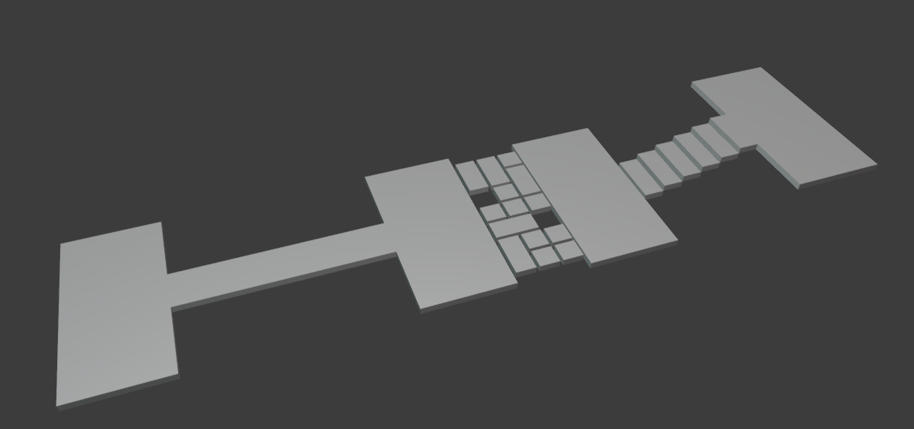

# random-scene-gen


Virtual scenes used for legged robot locomotion are randomly generated. Generated scenes are composed of big **planes**, **rubbles**, **stairs** and **bridges**. A mesh file of the scene is generated. The surface normal is recalculated using blender. The start/goal position, min/max bounds for guide path planing are saved into a pickle file. You will need it for [hpp](https://github.com/humanoid-path-planner), Humanoid Path Planner. This is all done in one script. 

## Dependencies
- pickle
- assimp
- blender

## Demo
1. Run the script in a root folder to generate a random scene mesh file with proper surface normals, and its problem file.
```sh
./run.sh SCENE_NAME_YOU_WANT
```
2. Copy the generated mesh file (.stl) in stl folder into a meshes folder in hpp-environment.
Make a relevent .urdf file in urdf folder. Make and Install the changes. *Refer to my hpp-environment repository ([meshes](https://github.com/daeunSong/hpp-environments/tree/master/meshes/multicontact/daeun), [urdf](https://github.com/daeunSong/hpp-environments/tree/master/urdf/multicontact/daeun)).*

3. To try guide path planning with the generated scene, run the script in a demo folder. You might have to change the urdf path in lp_urdfs_path.py file. It is denoted as a comment. 
```sh
cd demo
./run.sh SCENE_NAME_YOU_SAVED
```


If you are up-to-date with my hpp-environment repository ([link](https://github.com/daeunSong/hpp-environments)), demo below will work without any code modifications.
```sh
cd demo
./run.sh rubbles_1
./run.sh stairs_1
./run.sh rubbles_stairs_1
```
